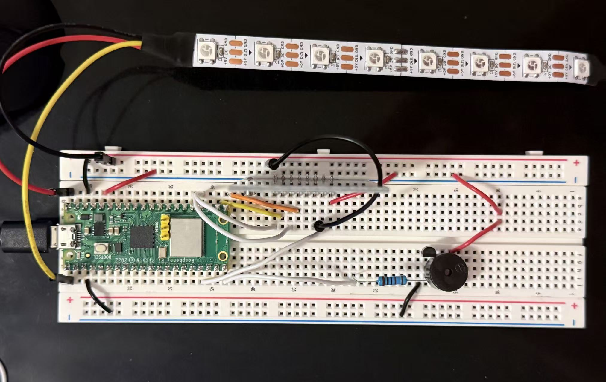

# Pico RFID Music Player

An RFID-based controller built using a Raspberry Pi Pico W and programmed in C/C++ with the Raspberry Pi Pico SDK in VScode.

## Features
- MFRC522 RFID reader support
- Buzzer audio playback
- WS2812 RGB LED feedback
- Raspberry Pi Pico SDK (C/C++)
- RFID-triggered actions/music playback

## Hardware
- Raspberry Pi Pico W
- MFRC522 RFID module
- WS2812 LEDs
- Passive buzzer
- Breadboard prototype

## Future Plans
- HID/macropad support
- RFID desktop profiles/modes
- OLED display integration
- Custom PCB design
